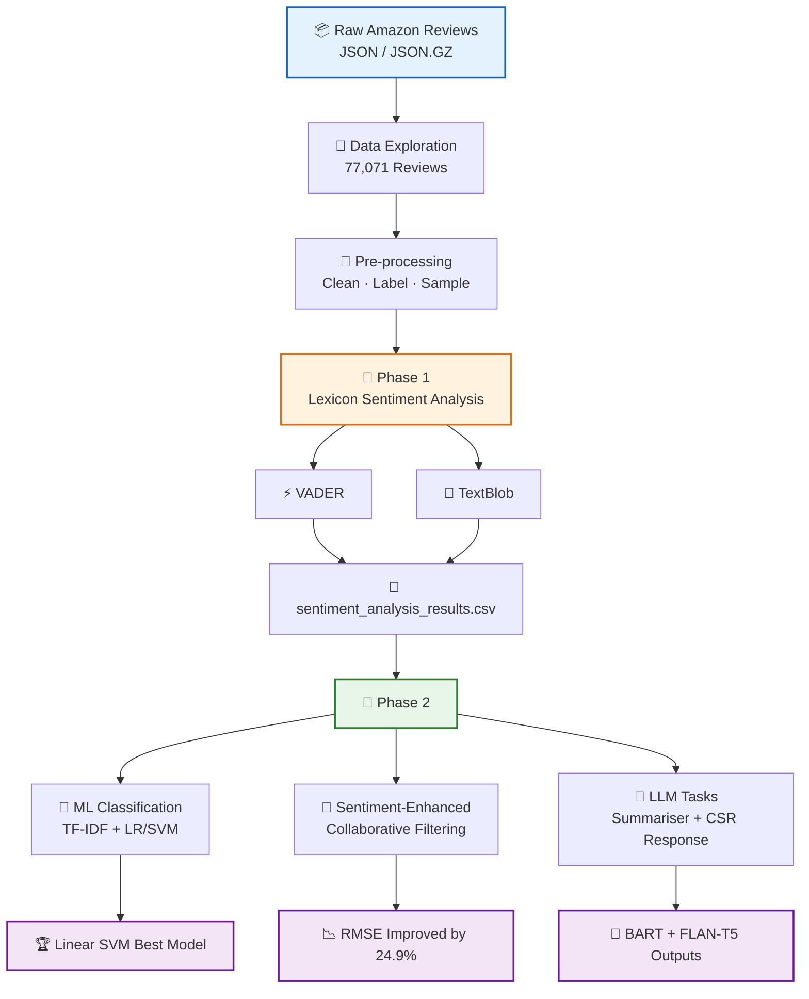
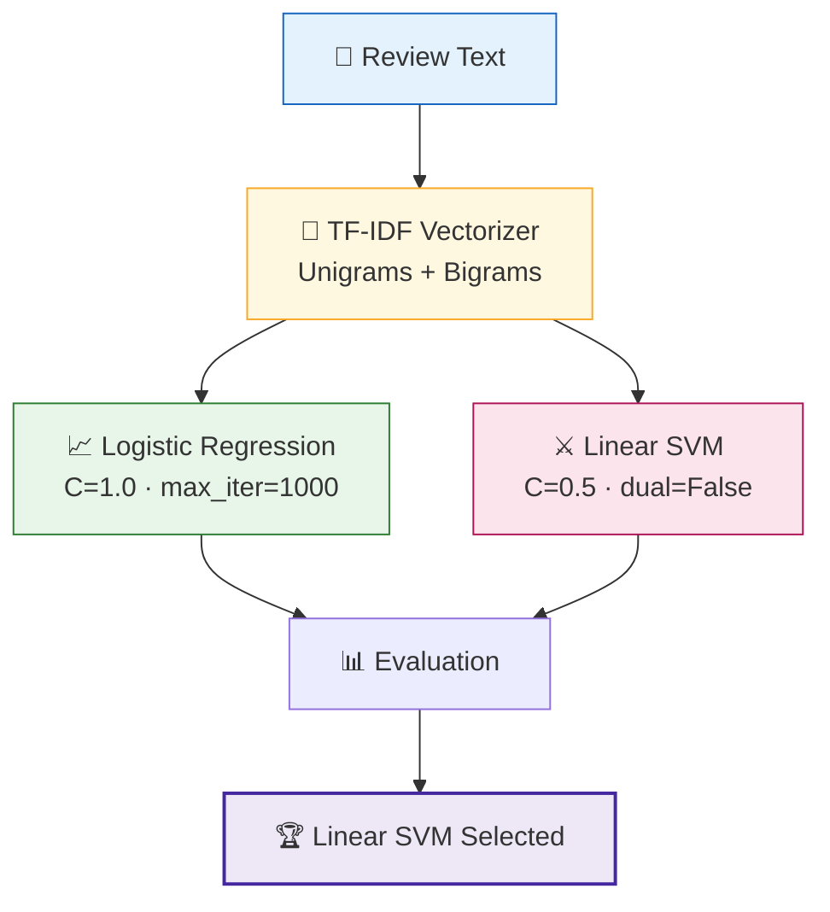
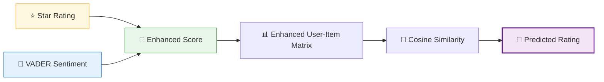

<div align="center">
[](https://www.python.org/)
[](https://scikit-learn.org/)
[](https://huggingface.co/)
[](https://www.nltk.org/)
[](https://github.com/cjhutto/vaderSentiment)
[](https://textblob.readthedocs.io/)

<br/>

### 🚀 From lexicon sentiment analysis to ML classification, LLM summarisation, and a sentiment-enhanced recommender system.

> **Core Question:** Can we accurately predict sentiment in technical product reviews and use that signal to improve product recommendations?
</div>
---

## 📋 Table of Contents

- [Overview](#-overview)
- [Architecture](#-architecture)
- [Dataset](#-dataset)
- [Phase 1 — Lexicon-Based Sentiment Analysis](#-phase-1--lexicon-based-sentiment-analysis)
- [Phase 2 — ML Models, Recommender & LLM](#-phase-2--ml-models-recommender--llm)
- [Results at a Glance](#-results-at-a-glance)
- [Getting Started](#-getting-started)
- [Project Structure](#-project-structure)
- [References](#-references)

---

## 🌐 Overview

This project builds an end-to-end NLP pipeline using **77,071 Amazon product reviews** from the **Industrial and Scientific** category.

The project is divided into two phases:

| Phase | Focus | Key Techniques |
|---|---|---|
| **Phase 1** | Lexicon-based sentiment analysis | VADER, TextBlob, stratified sampling |
| **Phase 2** | ML models, recommender system, and LLM tasks | TF-IDF, LR, Linear SVM, collaborative filtering, BART, FLAN-T5 |

---

## 🏗️ Architecture



---

## 📦 Dataset

| Attribute | Value |
|---|---:|
| **Source** | Amazon Product Reviews — Industrial & Scientific |
| **Total Reviews** | **77,071** |
| **Unique Products** | **5,334** |
| **Unique Users** | **11,041** |
| **Average Rating** | **4.52 / 5 ⭐** |
| **Average Review Length** | **241 characters · 44 words** |

### ⭐ Rating Distribution

| Rating | Count | Percentage | Visual |
|---|---:|---:|---|
| ⭐⭐⭐⭐⭐ | 56,150 | 72.9% | ████████████████████████████████░░ |
| ⭐⭐⭐⭐ | 12,061 | 15.6% | ███████░░░░░░░░░░░░░░░░░░░░░░░░░░ |
| ⭐⭐⭐ | 4,442 | 5.8% | ██░░░░░░░░░░░░░░░░░░░░░░░░░░░░░░░ |
| ⭐⭐ | 1,936 | 2.5% | █░░░░░░░░░░░░░░░░░░░░░░░░░░░░░░░░ |
| ⭐ | 2,482 | 3.2% | █░░░░░░░░░░░░░░░░░░░░░░░░░░░░░░░░ |

> ⚠️ **Class Imbalance Note:** The dataset is heavily skewed toward 5-star reviews. Because of this, **Macro F1** is used as the main evaluation metric because it treats each sentiment class equally.

---

## 📘 Phase 1 — Lexicon-Based Sentiment Analysis

Phase 1 builds a complete sentiment-analysis pipeline using lexicon-based methods.

### 🔄 Phase 1 Pipeline

```mermaid
flowchart LR
    A[Step 1<br/>Data Exploration] --> B[Step 2<br/>Pre-processing]
    B --> C[Step 3<br/>Lexicon Study]
    C --> D[Step 4<br/>Apply VADER + TextBlob]
    D --> E[Step 5<br/>Stratified Sampling]
    E --> F[Step 6<br/>Build Classifiers]
    F --> G[Step 7<br/>Compare Results]

    style A fill:#E3F2FD,stroke:#1976D2
    style B fill:#E8F5E9,stroke:#388E3C
    style C fill:#FFF8E1,stroke:#F9A825
    style D fill:#FCE4EC,stroke:#C2185B
    style E fill:#EDE7F6,stroke:#512DA8
    style F fill:#E0F2F1,stroke:#00796B
    style G fill:#FFF3E0,stroke:#EF6C00
```



### 🧹 Pre-processing Details

| Operation | Description |
|---|---|
| **Sentiment labelling** | 1–2 stars → Negative · 3 stars → Neutral · 4–5 stars → Positive |
| **Column selection** | `reviewText`, `summary`, `overall`, `reviewerID`, `asin` |
| **Outlier removal** | Removed reviews with fewer than 3 words or more than 2,000 words |
| **Text cleaning** | Lowercase, URL removal, punctuation stripping, NLTK stopword removal |
| **Stratified sampling** | 1,000 balanced reviews sampled across all sentiment classes |

### ⚖️ Lexicon Comparison — VADER vs TextBlob

| Metric | VADER | TextBlob | Winner |
|---|---:|---:|---|
| **Accuracy** | **79.3%** | 73.5% | ✅ VADER |
| **Macro F1** | **0.4748** | 0.4332 | ✅ VADER |
| **Weighted F1** | **0.8212** | 0.7854 | ✅ VADER |
| **Macro Recall** | **0.5143** | 0.4559 | ✅ VADER |
| **Agreement** | **79.2%** | 792 / 1,000 reviews | — |

### ✅ Why VADER Wins

- Handles **exclamation marks**, **ALL-CAPS**, and **intensity modifiers**.
- Performs better on product-review language.
- Provides stronger recall for Negative and Neutral classes.
- TextBlob is more conservative and often predicts Neutral.

> Both lexicon models are limited by fixed vocabularies. They cannot learn domain-specific terms such as **defect**, **stripped threads**, or **broke**, which motivates Phase 2.

---

## 📗 Phase 2 — ML Models, Recommender & LLM

Phase 2 extends the project with supervised ML, collaborative filtering, and transformer-based LLM tasks.

### 🤖 Steps 11–13: TF-IDF + Machine Learning



### 🏆 Step 14: Cross-Model Comparison

| Rank | Model | Accuracy | F1-Macro | F1-Weighted |
|---:|---|---:|---:|---:|
| 🥇 | **Linear SVM** | **83.9%** | **0.6363** | **0.8649** |
| 🥈 | Logistic Regression | 83.2% | 0.6285 | 0.8597 |
| 🥉 | VADER Lexicon | 79.3% | 0.4748 | 0.8212 |
| 4 | TextBlob Lexicon | 73.5% | 0.4332 | 0.7854 |

### 🔑 Key Findings

- ML models outperform lexicon-based methods by **+13–15% Macro F1**.
- The **Neutral** class is the hardest to classify because 3-star reviews often contain mixed language.
- Linear SVM learns domain-specific negative terms such as `broke`, `defect`, and `return`.
- **Recommended production model:** Linear SVM with TF-IDF.

---

## 🛒 Step 15: Sentiment-Enhanced Recommender System

The recommender system uses item-based collaborative filtering and improves it by blending star ratings with VADER sentiment scores.

### 🧮 Enhanced Rating Formula

```text
sentiment_score  = (vader_compound + 1) / 2
normalised_star  = (star_rating - 1) / 4
enhanced_score   = 0.6 × normalised_star + 0.4 × sentiment_score
enhanced_rating  = enhanced_score × 4 + 1
```



### 📉 Recommender Results

| Metric | Original CF | Sentiment-Enhanced CF | Improvement |
|---|---:|---:|---:|
| **MAE** | 0.2445 | **0.2282** | ✅ **+6.7%** |
| **RMSE** | 0.7076 | **0.5316** | ✅ **+24.9%** |

> Blending sentiment scores provides a smoother and more nuanced signal, especially for products where star ratings alone do not fully explain user satisfaction.

---

## 📝 Steps 16–17: LLM Tasks with HuggingFace

| Step | Task | Model Used | Purpose |
|---|---|---|---|
| **Step 16** | Review summarisation | `facebook/bart-large-cnn` | Condense long reviews into concise summaries |
| **Step 17** | CSR response generation | `google/flan-t5-base` | Generate polite customer service replies to negative reviews |

> ⚠️ First run downloads HuggingFace model weights, approximately **250 MB to 1.6 GB**. Later runs use the local cache in `~/.cache/huggingface/`.

---

## 📊 Results at a Glance

### 🧠 Model Performance Summary

| Model | Accuracy | F1-Macro | F1-Weighted | Notes |
|---|---:|---:|---:|---|
| 🥇 **Linear SVM** | **83.9%** | **0.6363** | **0.8649** | Best overall model |
| 🥈 Logistic Regression | 83.2% | 0.6285 | 0.8597 | Very close to SVM |
| 🥉 VADER Lexicon | 79.3% | 0.4748 | 0.8212 | Best lexicon method |
| TextBlob Lexicon | 73.5% | 0.4332 | 0.7854 | More conservative predictions |

### 🛒 Recommender System Summary

| Approach | MAE | RMSE | Result |
|---|---:|---:|---|
| Original Ratings CF | 0.2445 | 0.7076 | Baseline |
| **Sentiment-Enhanced CF** | **0.2282** | **0.5316** | ✅ Better |
| **Improvement** | **+6.7%** | **+24.9%** | Strong RMSE improvement |

---

## 🚀 Getting Started

### ✅ Prerequisites

- Python **3.9+**
- Pip package manager
- Amazon Industrial & Scientific review dataset: `.json` or `.json.gz`

### ▶️ Run Phase 1

```bash
cd Phase#1
pip install -r requirements.txt
python main.py
```

### ▶️ Run Phase 2

```bash
cd Phase#2
pip install -r requirements_phase2.txt
python main_phase2.py
```

### ⚙️ Optional Phase 2 Flags

```bash
python main_phase2.py --skip-llm           # Skip LLM steps, Steps 16–17
python main_phase2.py --skip-recommender   # Skip recommender, Step 15
python main_phase2.py --skip-comparison    # Skip cross-comparison, Step 14
python main_phase2.py --skip-ml            # Skip ML modeling, Steps 11–13
```

> **Important:** Run **Phase 1 before Phase 2** because `sentiment_analysis_results.csv` is required as input for Step 14.

---

## 📦 Dependencies Overview

| Package | Purpose |
|---|---|
| `pandas`, `numpy` | Data manipulation |
| `matplotlib`, `seaborn` | Visualisation |
| `vaderSentiment` | VADER lexicon scorer |
| `textblob` | TextBlob lexicon scorer |
| `nltk` | Tokenisation and stopwords |
| `scikit-learn` | TF-IDF, Logistic Regression, LinearSVC |
| `transformers`, `torch` | HuggingFace LLM models |
| `wordcloud` | Word cloud visualisations |

---

## 📁 Project Structure

```text
sentiment-analysis-recommender-system/
│
├── README.md
├── How to run.txt
│
├── Phase#1/
│   ├── main.py                        # 🚀 Phase 1 entry point
│   ├── data_exploration.py            # Step 1  — Dataset stats & distributions
│   ├── preprocessing.py               # Step 2  — Cleaning, labelling, sampling
│   ├── lexicon_analysis.py            # Step 3  — VADER & TextBlob deep-dive
│   ├── sentiment_analysis.py          # Step 6-7 — Model building & evaluation
│   ├── requirements.txt               # Phase 1 dependencies
│   │
│   ├── preprocessed_data.csv          # Cleaned dataset
│   ├── sentiment_analysis_results.csv # Predictions from 1,000 reviews
│   ├── model_comparison_table.csv     # VADER vs TextBlob metrics
│   ├── data_exploration_summary.txt   # Dataset statistics report
│   ├── lexicon_comparison_report.txt  # Detailed lexicon comparison
│   └── model_comparison_conclusion.txt
│
└── Phase#2/
    ├── main_phase2.py                 # 🚀 Phase 2 entry point
    ├── ml_modeling.py                 # Steps 11-13 — TF-IDF + LR + SVM
    ├── model_comparison.py            # Step 14 — Cross-model comparison
    ├── recommender.py                 # Step 15 — Sentiment-enhanced CF
    ├── llm_tasks.py                   # Steps 16-17 — Summariser + CSR generation
    ├── requirements_phase2.txt        # Phase 2 dependencies
    │
    ├── ml_comparison_table.csv        # ML model metrics
    ├── step14_comparison_table.csv    # All-model comparison
    ├── step14_all_predictions.csv     # All model predictions
    ├── step14_conclusion.txt          # Cross-model conclusion
    ├── step15_cf_results.csv          # Recommender results
    ├── step15_conclusion.txt          # Recommender conclusion
    ├── step16_summaries.txt           # LLM-generated summaries
    ├── step17_csr_response.txt        # LLM-generated CSR responses
    ├── step16_17_report_results.txt   # Full LLM report
    │
    └── models/
        ├── tfidf_vectorizer.pkl       # Trained TF-IDF vectorizer
        ├── logistic_regression.pkl    # Trained Logistic Regression model
        └── linear_svm.pkl             # Trained Linear SVM model
```

---

## 📚 References

- Ni, J., Li, J., & McAuley, J. (2019). *Justifying recommendations using distantly-labeled reviews and fine-grained aspects.* EMNLP-IJCNLP 2019. https://nijianmo.github.io/amazon/index.html
- Hutto, C. J., & Gilbert, E. (2014). *VADER: A Parsimonious Rule-based Model for Sentiment Analysis of Social Media Text.* ICWSM 2014.
- Lewis, M., et al. (2020). *BART: Denoising Sequence-to-Sequence Pre-training for Natural Language Generation.* ACL 2020.
- Chung, H. W., et al. (2022). *Scaling Instruction-Finetuned Language Models (FLAN-T5).* Google Research.

---

<div align="center">

## ✅ Final Recommendation

**Use Linear SVM with TF-IDF for sentiment classification and Sentiment-Enhanced Collaborative Filtering for recommendations.**

<br/>


</div>
